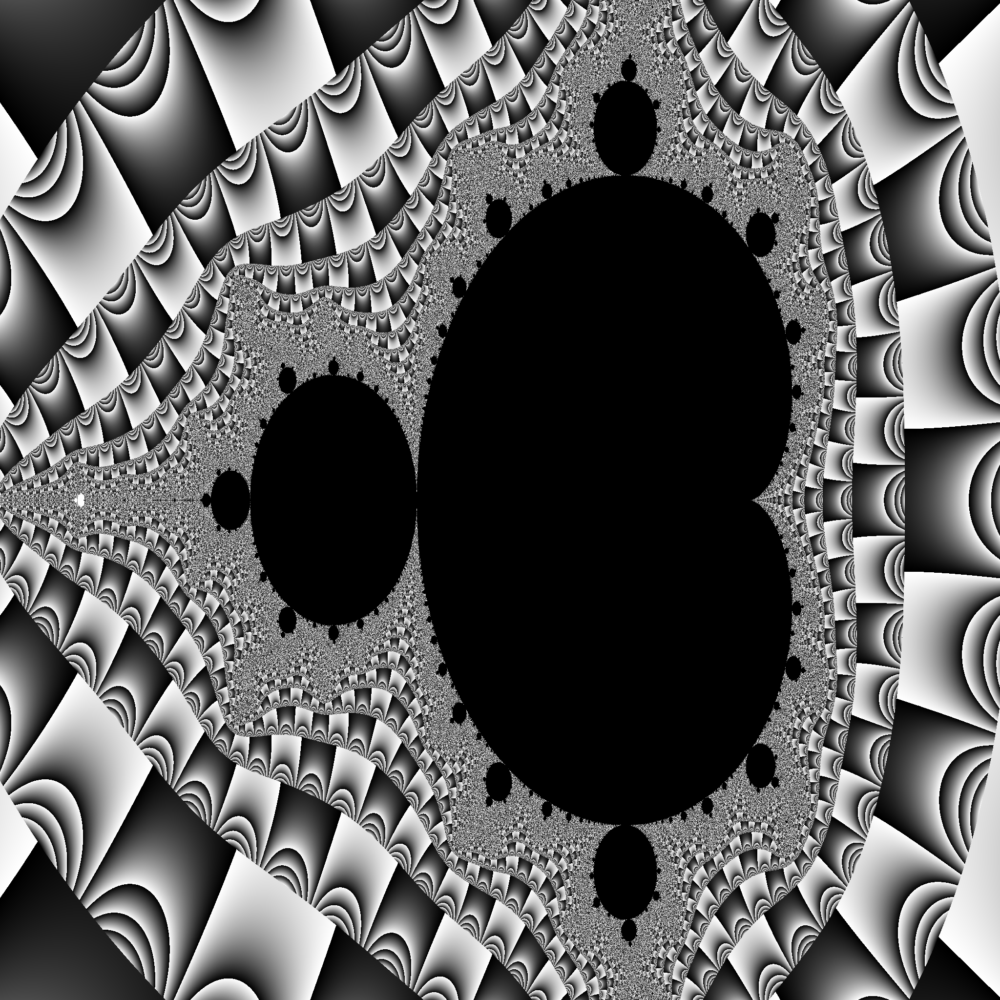

# Using the Go tracer

Watch the episode here:

<div style="text-align:center">
    <a href="https://www.youtube.com/watch?v=ySy3sR1LFCQ&feature=youtu.be&list=PL6">
        
        <p>justforfunc 22: using the Go tracer</p>
    </a>
</div>

What is the fastest way to compute a Mandelbrot set like the one below?



The final times are

| mode                  | seconds |
|-----------------------|---------|
| sequential            |   4.669 |
| pixels                |   3.004 |
| cols                  |   0.689 |
| workers               |   2.967 |
| workers + buffer      |   1.226 |
| col workers           |   0.714 |
| col workers + buffer  |   0.698 |

You can run the benchmarks yourself by running:

```bash
$ go test -bench=.

```

<<<<<<< HEAD
If you want to run only the benchmarks for given size (e.g. 64) use:

```bash
$ go test -bench=./64
goos: darwin
goarch: amd64
pkg: github.com/campoy/justforfunc/22-perf
BenchmarkSeq/64-8                            300           4534800 ns/op
BenchmarkPixel/64-8                         2000           1083436 ns/op
BenchmarkCol/64-8                           2000            905426 ns/op
BenchmarkWorkers/64-8                        500           2698059 ns/op
BenchmarkWorkersBuffered/64-8               2000           1114785 ns/op
BenchmarkRowWorkers/64-8                    2000            772574 ns/op
BenchmarkRowWorkersBuffered/64-8            2000            745455 ns/op
PASS
ok      github.com/campoy/justforfunc/22-perf   13.190s
```

Also, modify the constant named `complexity` in the `pixel` function to compute simpler or more complex fractals.
