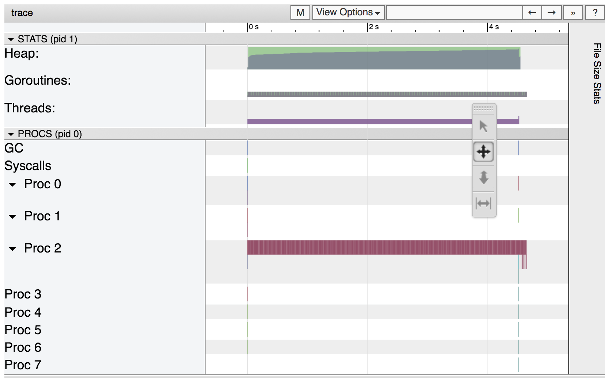
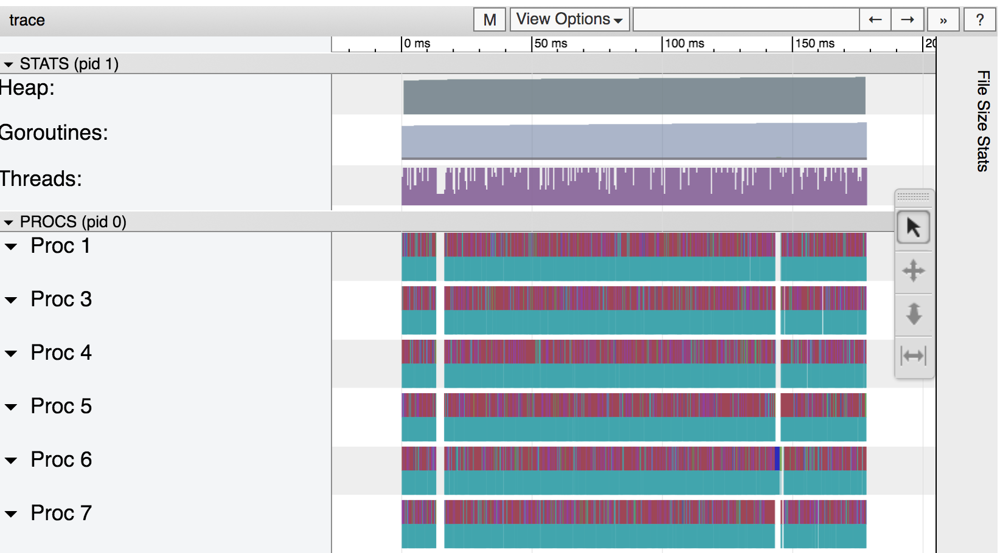
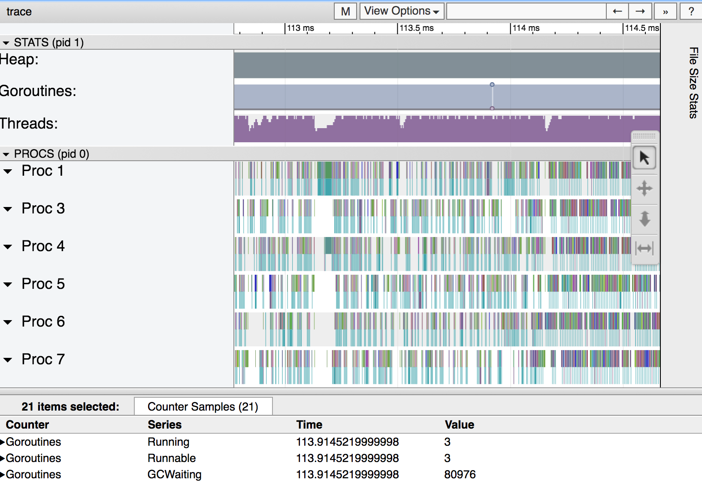
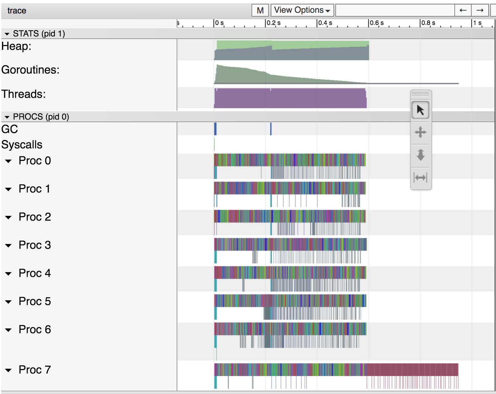
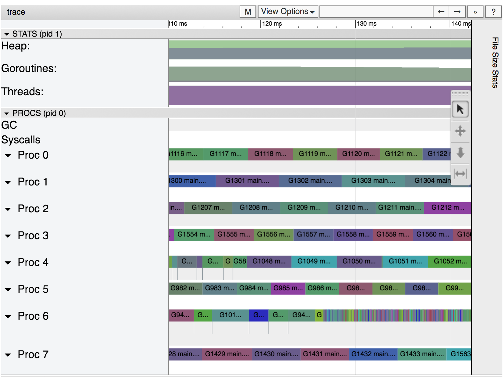
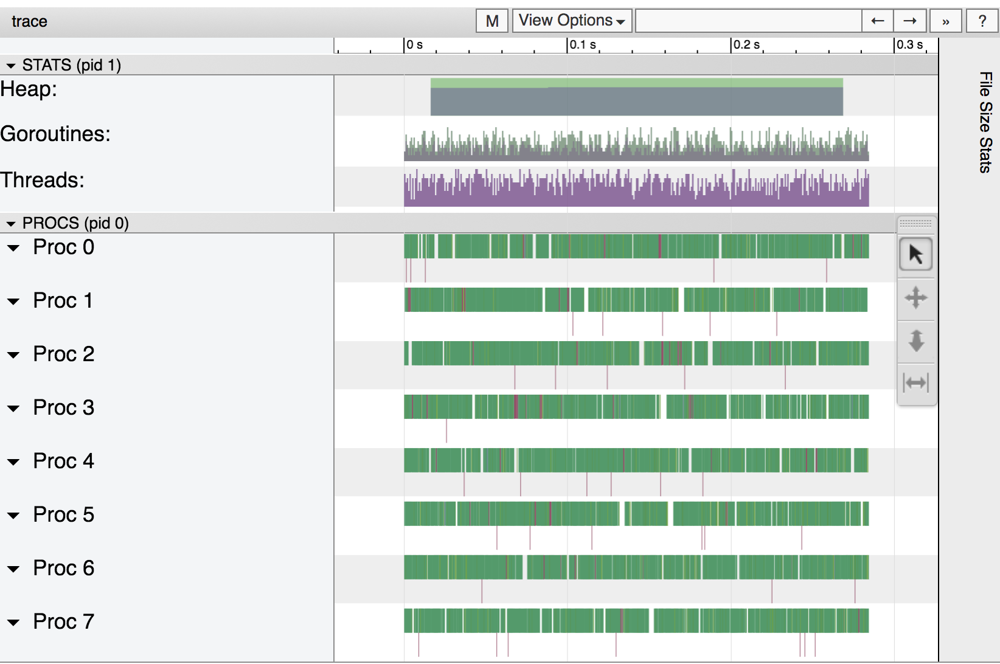
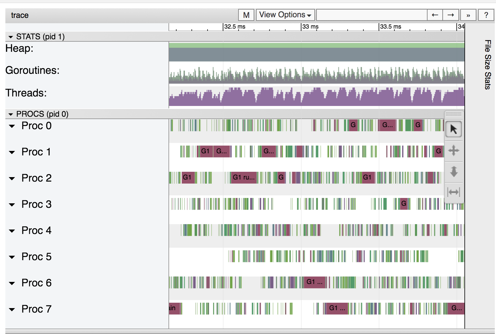
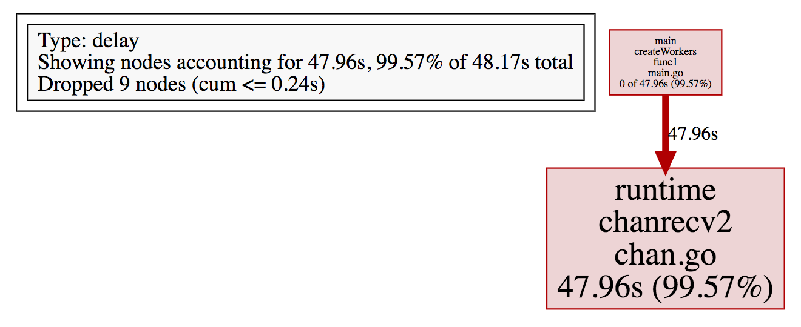
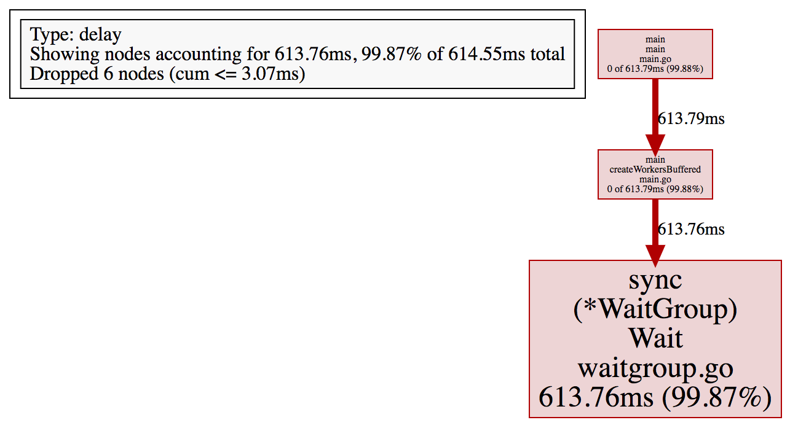

# Using the Go tracer to speed up fractal making

As an experiment, this is the first blog post form of a
[justforfunc](https://www.youtube.com/watch?v=ySy3sR1LFCQ) episode,
you can also watch the corresponding episode.

<div style="text-align:center">
    <a href="https://www.youtube.com/watch?v=ySy3sR1LFCQ&feature=youtu.be&list=PL6">
        
        <p>justforfunc 22: using the Go tracer</p>
    </a>
</div>


## The initial program

We start with a very simple program, copied partly from Wikipedia, that creates a Mandelbrot fractal by
first computing the color of each pixel, and then writing the corresponding image to a PNG file.

```go
func main() {
	f, err := os.Create(output)
	if err != nil {
		log.Fatal(err)
	}

	img := createSeq(width, height)

	if err = png.Encode(f, img); err != nil {
		log.Fatal(err)
	}
}
```

In this first iteration `createSeq`, which calls `pixel`
to compute the color of each pixel, one after the other.

[embedmd]:# (main.go /func createSeq/ /^}/)
```go
func createSeq(width, height int) image.Image {
	m := image.NewGray(image.Rect(0, 0, width, height))
	for i := 0; i < width; i++ {
		for j := 0; j < height; j++ {
			m.Set(i, j, pixel(i, j, width, height))
		}
	}
	return m
}
```

Finally, the part that is basically extracted from Wikipedia allows
us to compute the color of a given pixel. The `complexity` value
determines how complex the fractal gets, values from 4 to 2048 give
various and interesting effects. Play with this!

[embedmd]:# (main.go /func pixel/ /^}/)
```go
func pixel(i, j, width, height int) color.Color {
	// Play with this constant to increase the complexity of the fractal.
	// In the justforfunc.com video this was set to 4.
	const complexity = 1024

	xi := norm(i, width, -1.0, 2)
	yi := norm(j, height, -1, 1)

	const maxI = 1000
	x, y := 0., 0.

	for i := 0; (x*x+y*y < complexity) && i < maxI; i++ {
		x, y = x*x-y*y+xi, 2*x*y+yi
	}

	return color.Gray{uint8(x)}
}
```

## How fast is it?

At this point our program runs and creates a cool fractal, and it takes
(in my laptop) around 4.7 seconds.

```bash
$ time ./mandelbrot
./mandelbrot  4.44s user 0.01s system 99% cpu 4.466 total
```

The resulting image is this cool fractal.


## Can we make it faster? pprof

In order to obtain more information about how the program
performs we can profile the CPU usage with the `runtime/pprof`
package in the standard library.

Simply adding two lines of code at the beginning of the `main` function.

```go
	pprof.StartCPUProfile(os.Stdout)
	defer pprof.StopCPUProfile()
```

Now if we run the program again it will output `pprof` profiling
information into the standard output.

```bash
$ time ./mandelbrot > cpu.pprof
./mandelbrot > cpu.pprof  5.25s user 0.02s system 96% cpu 5.469 total
```

Interestingly, adding `pprof` has not slowed the program much!
And in exchange of that temporary performance hit we get much
visibility on what the program spent its time on.

Let's open pprof and see what it spent its time on.

```bash
$ go tool pprof cpu.pprof
Type: cpu
Time: Oct 23, 2017 at 11:04am (CEST)
Duration: 5.45s, Total samples = 4.53s (83.13%)
Entering interactive mode (type "help" for commands, "o" for options)
(pprof)
```

We can now list how much time we spend in each function we call
with `list`.

```bash
(pprof) list main.main
Total: 4.53s
ROUTINE ======================== main.main in /Users/campoy/src/github.com/campoy/justforfunc/22-perf/main.go
         0      4.15s (flat, cum) 91.61% of Total
         .          .     39:   f, err := os.Create(output)
         .          .     40:   if err != nil {
         .          .     41:           log.Fatal(err)
         .          .     42:   }
         .          .     43:
         .      3.89s     44:   img := createSeq(width, height)
         .          .     45:
         .      260ms     46:   if err = png.Encode(f, img); err != nil {
         .          .     47:           log.Fatal(err)
         .          .     48:   }
         .          .     49:}
         .          .     50:
         .          .     51:// createSeq fills one pixel at a time.
```

Ok, so it seems we spent most of the time in `createSeq`, makes sense!

```bash
(pprof) list main.createSeq
Total: 4.53s
ROUTINE ======================== main.createSeq in /Users/campoy/src/github.com/campoy/justforfunc/22-perf/main.go
         0      3.89s (flat, cum) 85.87% of Total
         .          .     51:// createSeq fills one pixel at a time.
         .          .     52:func createSeq(width, height int) image.Image {
         .          .     53:   m := image.NewGray(image.Rect(0, 0, width, height))
         .          .     54:   for i := 0; i < width; i++ {
         .          .     55:           for j := 0; j < height; j++ {
         .      3.89s     56:                   m.Set(i, j, pixel(i, j, width, height))
         .          .     57:           }
         .          .     58:   }
         .          .     59:   return m
         .          .     60:}
         .          .     61:
```

Great, again most of the time is in the line calling `pixel`, and what does `pixel` do?

```bash
(pprof) list main.pixel
Total: 4.53s
ROUTINE ======================== main.pixel in /Users/campoy/src/github.com/campoy/justforfunc/22-perf/main.go
     2.01s      3.87s (flat, cum) 85.43% of Total
         .          .    209:func pixel(i, j, width, height int) color.Color {
         .          .    210:   // Play with this constant to increase the complexity of the fractal.
         .          .    211:   // In the justforfunc.com video this was set to 4.
         .          .    212:   const complexity = 1024
         .          .    213:
         .       10ms    214:   xi := norm(i, width, -1.0, 2)
         .          .    215:   yi := norm(j, height, -1, 1)
         .          .    216:
         .          .    217:   const maxI = 1000
         .          .    218:   x, y := 0., 0.
         .          .    219:
     1.29s      1.29s    220:   for i := 0; (x*x+y*y < complexity) && i < maxI; i++ {
     720ms      720ms    221:           x, y = x*x-y*y+xi, 2*x*y+yi
         .          .    222:   }
         .          .    223:
         .      1.85s    224:   return color.Gray{uint8(x)}
         .          .    225:}
```

Ok, so we spend a decent amount of time computing multiplications in that loop, also a lot
of time allocating pixels in line 224.

### So what now?

We have a better idea of what our program spends most of the time: computing pixel values.
But what do we do now? It seems reasonable that a program that generates fractals spends
most of the time, well ... generating fractals!

There's things we could do to try and optimize the CPU time, but in this post instead of going
that way, we're going to see what other things we can do to speed up the program without
changing the `pixel` function.

## Meet the tracer

One of the problems of `pprof` is that it is a stastistical way of discovering how often a given piece
of code is running. It allows us to understand what the program is running when it's on the CPU, but
what about when it's not? We're missing information that we can not (or at least not easily) extract
from a pprof trace.

The Go tracer, rather than pinging the program regularily to understand what it is up to, it instead
hooks to the Go runtime to log every single event we care about. These events include:

- go routine creation and destruction
- blocking events such as channel or mutex operations
- system calls
- etc

The most powerful side of the Go tracer is the amazing visualization it generates, which allows us
to see the "empty" space in our program.

Let's create a trace from this program, by simply replacing our `pprof` calls by calls to the `runtime/trace`
package also in the standard library.

```go
	trace.Start(os.Stdout)
	defer trace.Stop()
```

Then we can execute the program again an visualize the trace with `go tool trace`.

```bash
$ time ./mandelbrot > seq.trace
./mandelbrot > seq.trace  5.11s user 0.04s system 99% cpu 5.176 total

$ go tool seq.trace
2017/10/23 11:16:55 Parsing trace...
2017/10/23 11:16:55 Serializing trace...
2017/10/23 11:16:55 Splitting trace...
2017/10/23 11:16:55 Opening browser
```

This will open a browser and display a webpage that, among others, has a link to `View Trace`. Click there and you should be something like this:



I invite you to explore the visualization, specially the garbage collection event towards the end.
But the most important point here is everything we can't see.

Do you see those 8 `Proc`? Those are the eight processors that my laptop has. Only one of them,
processor 2 in my case, is really doing any work! 

One of Go's powers is easy concurrency, right? Well, it's time to use those, because we clearly
are wasting CPU time by not expressing our program in a concurrent way which would enable parallelism.

## More concurrency, more parallelism, more speed!

Let's go to a ridiculuous extreme and decide that, since each pixel can be computed concurrently,
we are going to create a goroutine per pixel. This, for our 2048x2048 image, means we're going to
create over four million goroutines. We say goroutines are cheap ... so let's seee if that's true!

The function that creates a goroutine per pixel is called `createPixel`:

[embedmd]:# (main.go /func createPixel/ /^}/)
```go
func createPixel(width, height int) image.Image {
	m := image.NewGray(image.Rect(0, 0, width, height))
	var w sync.WaitGroup
	w.Add(width * height)
	for i := 0; i < width; i++ {
		for j := 0; j < height; j++ {
			go func(i, j int) {
				m.Set(i, j, pixel(i, j, width, height))
				w.Done()
			}(i, j)
		}
	}
	w.Wait()
	return m
}
```

Ok, so first of all let's run it without the tracer to see how fast it is and compare it to the sequential
option.

```bash
$ time ./mandelbrot
./mandelbrot  13.70s user 1.53s system 471% cpu 3.234 total
```

Wow, it's actually faster! It used much more CPU time (13.70s) but since it distributed it so efficiently
across our eight CPUs, the total time it spent running was only 3.2 seconds.

Victory! Right?

Well, let's create a trace and see what it looks like.

```bash
$ time ./mandelbrot > px.trace
./mandelbrot > px.trace  25.64s user 5.46s system 502% cpu 6.184 total
```

Wow, we spent almost twice of CPU cycles than before! Why is this? Well, the tracer has a performance cost,
and in this case we're logging each and every goroutine we create. This, by itself, might point to problem
in our solution.

Let's open the trace, and be warned it's not going to be fast!

```bash
$ go tool trace px.trace
2017/10/23 11:29:17 Parsing trace...
2017/10/23 11:29:58 Serializing trace...
2017/10/23 11:30:13 Splitting trace...
2017/10/23 11:30:49 Opening browser
```

The trace has been split into many pieces to avoid overloading the browser. Let's open one somewhere around
the center. This, again, will be quite slow. Patience is your friend.



It seems like the CPUs are *really* busy this time! But, let's zoom in a bit.



Oh, that doesn't seem like it's very well utilized after all. We've created too many goroutines,
which causes too much pressure on the runtime, both the scheduler and the garbage collector, and
it shows as contention and wasted CPU time.

## Finding compromise in between too few and too many

Ok, so one goroutine is too many, but four millions is too much. Let's go right in between and
go with one goroutine per row. This time we'll call `createRow` which creates a goroutine per
row, so "only" 2048 of them.

[embedmd]:# (main.go /func createRow/ /^}/)
```go
func createRow(width, height int) image.Image {
	m := image.NewGray(image.Rect(0, 0, width, height))
	var w sync.WaitGroup
	w.Add(width)
	for i := 0; i < width; i++ {
		go func(i int) {
			for j := 0; j < height; j++ {
				m.Set(i, j, pixel(i, j, width, height))
			}
			w.Done()
		}(i)
	}
	w.Wait()
	return m
}
```

As before, let's run it without trace first to see whether we improve the 3.2 seconds we got before.

```bash
$ time ./mandelbrot
./mandelbrot  4.90s user 0.02s system 499% cpu 0.985 total
```

Ok, we went from almost five seconds, to three, and now less than a second!

What does the trace look like? Let's check it out.

```bash
$ time ./mandelbrot > row.trace
./mandelbrot > row.trace  4.79s user 0.02s system 498% cpu 0.966 total

$ go tool trace row.trace
2017/10/23 11:41:29 Parsing trace...
2017/10/23 11:41:29 Serializing trace...
2017/10/23 11:41:30 Splitting trace...
2017/10/23 11:41:30 Opening browser
```



That looks pretty good! We can see that the CPUs are pretty busy first, then we move to one goroutine
to encode the image into the file. Let's zoom in, though (feeling like CSI already?).



That looks very good! But, can we do better?

## What about the "workers" concurrency pattern?

If you've written enough Go, you migh have encountered the "workers" pattern, where we create a small
number of workers (eight in this case) which fetch tasks from a channel. We also use a `sync.WaitGroup`
to make sure all workers are done before exiting.

[embedmd]:# (main.go /func createWorkers/ /^}/)
```go
func createWorkers(width, height int) image.Image {
	m := image.NewGray(image.Rect(0, 0, width, height))

	type px struct{ x, y int }
	c := make(chan px)

	var w sync.WaitGroup
	w.Add(8)
	for i := 0; i < 8; i++ {
		go func() {
			for px := range c {
				m.Set(px.x, px.y, pixel(px.x, px.y, width, height))
			}
			w.Done()
		}()
	}

	for i := 0; i < width; i++ {
		for j := 0; j < height; j++ {
			c <- px{i, j}
		}
	}
	close(c)
	w.Wait()
	return m
}
```

We have a smaller number of goroutines, but definitely enough of them to distribute across all processors.
This should be faster, right?

Well, never trust your instincts when it comes to performance analysis.

Let's run it and see, first without the tracer.

```bash
$ time ./mandelbrot
./mandelbrot  10.31s user 3.22s system 422% cpu 3.201 total
```

Ok, so this is not better than creating a pixel per goroutine! Why? Well, time to trace.

```bash
$ time ./mandelbrot > workers.trace
./mandelbrot > workers.trace  30.86s user 13.88s system 383% cpu 11.660 total

$ go tool trace workers.trace
2017/10/23 11:49:20 Parsing trace...
2017/10/23 11:49:52 Serializing trace...
2017/10/23 11:50:02 Splitting trace...
2017/10/23 11:50:49 Opening browser
```

This is again incredibly slow, so clearly we're logging many events. What are those events?



Again it seems quite good from far away, but when you zoom in it looks quite different.



Where is the contention coming from now? The runtime should be totally fine with eight goroutines,
2048 was not too many. Well, let's go back to the menu where we clicked "View Trace" but instead
let's click `Synchronization blocking profile`. You'll see a graph generated by our old friend `pprof`.
In this graph we can see the contention due to synchronization primitives such as channels and mutexes.



So our goroutines spent almost 48 seconds blocked receiving from a channel!
That's, obviously, a problem.

Why is this? Our channel is being used as a way to communicate between the main
goroutine sending pixels, and the workers. This happens 4 million times, which
causes a lot of contention. How could be avoid most of this contention?

## Buffered channels!

Buffered channels in this case will make most of the send and receive operations non blocking!
You don't trust me? You don't need to. Let's modify the program to use a channel with a buffer
of a size that allows us to fit all of the pixels.

[embedmd]:# (main.go /func createWorkersBuffered/ /make\(chan.*/)
```go
func createWorkersBuffered(width, height int) image.Image {
	m := image.NewGray(image.Rect(0, 0, width, height))

	type px struct{ x, y int }
	c := make(chan px, width*height)
```

The rest of the function is exactly as the previous one.

Will this make our program faster? Let's see!

```bash
$ time ./mandelbrot
./mandelbrot  8.55s user 0.37s system 494% cpu 1.804 total
```

It is much faster than before but still not nearly as fast as creating one goroutine per row.

The tracer shows that we still have some contention, and pprof quantifies it to 613ms.

```bash
$ time ./mandelbrot > workers-buf.trace
./mandelbrot > workers-buf.trace  8.06s user 0.29s system 542% cpu 1.539 total

$ go tool trace workers-buf.trace
2017/10/23 12:04:51 Parsing trace...
2017/10/23 12:04:51 Serializing trace...
2017/10/23 12:04:51 Splitting trace...
2017/10/23 12:04:51 Opening browser
```



## Compromises

Sending values through channels has a very low cost, but it does have a cost and we're doing this
over 4 million times in this program.

It seems like a good idea to limit this cost by creating fewer tasks. How can we even do that?
Each task should be larger: let's create a task per row.

[embedmd]:# (main.go /func createRowWorkers/ /^}/)
```go
func createRowWorkers(width, height int) image.Image {
	m := image.NewGray(image.Rect(0, 0, width, height))

	c := make(chan int)

	var w sync.WaitGroup
	w.Add(8)
	for i := 0; i < 8; i++ {
		go func() {
			for i := range c {
				for j := 0; j < height; j++ {
					m.Set(i, j, pixel(i, j, width, height))
				}
			}
			w.Done()
		}()
	}

	for i := 0; i < width; i++ {
		c <- i
	}

	close(c)
	w.Wait()
	return m
}
```

How much faster is this?

```bash
$ time ./mandelbrot
./mandelbrot  4.72s user 0.04s system 495% cpu 0.962 total
```

Pretty fast! And if we added a buffer to the channel, as shown in `createRowWorkersBuffered`?

```bash
$ time ./mandelbrot
./mandelbrot  4.74s user 0.04s system 513% cpu 0.931 total
```

Just a tiny bit better.

# Conclusion

So, it seems like creating one goroutine per row is the fastest option, but probably this changes
given different image sizes. It is time to write benchmarks (they're already written in the repo!),
look at the traces and pprof data and make sensible and informed decisions.

We saw how pprof allows us to see how our program uses the CPU and how much locking contention exists.
Pprof also provides a way to profile memory allocations which we didn't cover.
On the other side we saw the tracer, that allows us to have a very detailed view of what our program
does, specially when our program doesn't do much!

I hope you enjoyed this post, let me know what you think at [@francesc](https://twitter.com/francesc)
and subscribe to [#justforfunc](http://justforfunc.com) for more content every two weeks!
