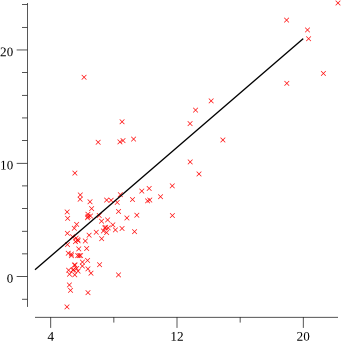

# Plotting Data with gonum/plot (ML4G #1)

For the first episode of this mini series on Machine Learning for Gophers (#ML4G) we're going to learn how to plot data with gonum/plot.

It might seem simple, but there's lots to learn!

    <a href="https://youtu.be/ihP7lQivA6M">
        
        
justforfunc #34: Plotting Data with gonum/plot (ML4G #1)

    </a>

References:
- gonum: https://gonum.org
- gonum/plot docs: https://godoc.org/gonum.org/v1/plot

