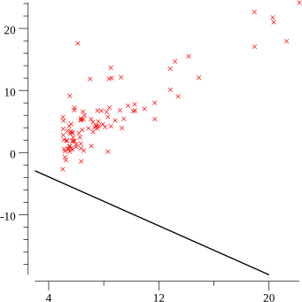

# Linear Regression with Gradient Descent (ML4G #1)

In a [previous episode](https://www.youtube.com/watch?v=ihP7lQivA6M) we learned how to plot data with gonum and we added a line that approximated those points ... but we totally made that up!

During this episode we'll cover how to evaluate how good a line matches the points and how to find the best line possible by using gradient descent.

- gonum: https://gonum.org
- gonum/plot docs: https://godoc.org/gonum.org/v1/plot
- derivatives: https://en.wikipedia.org/wiki/Derivative

    <a href="https://youtu.be/ZPd_fKyrX48">
        
        
justforfunc #38: Linear Regression with Gradient Descent (ML4G #2)

    </a>

References:
- gonum: https://gonum.org
- gonum/plot docs: https://godoc.org/gonum.org/v1/plot

